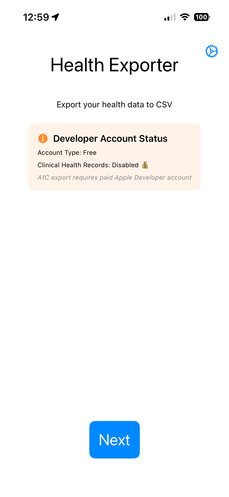
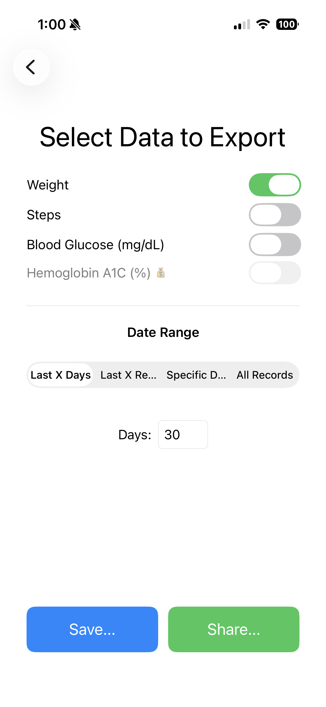
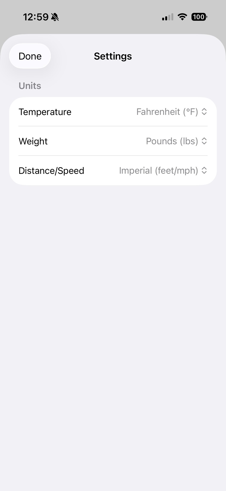

# Health Exporter

A privacy-focused iOS app that exports Apple HealthKit data to CSV files. All data processing happens entirely on-device — no health data is ever sent to external servers.

## Features

- **Privacy-first design**: All processing on-device, no analytics, no tracking, no accounts
- **Multiple health metrics**: Export Weight, Steps, Blood Glucose (mg/dL), and Hemoglobin A1C (%)
- **Flexible date ranges**: Last X days, last X records, custom date range, or all data
- **Unit preferences**: Configure weight units (kg/lbs), temperature (°C/°F), and distance/speed (metric/imperial)
- **Dual export options**:
  - **Save**: Save directly to Files app via `.fileExporter()`
  - **Share**: Share via iOS share sheet (Dropbox, Google Drive, email, etc.)
- **Splash screen** with navigation to data selection and settings
- **Settings persistence**: Unit preferences are automatically saved
- **Availability gating**: A1C export requires Clinical Health Records capability and a paid Apple Developer account
- **Memory-optimized**: Health data is cleared from memory immediately after export

## Screenshots

<table>
  <tr>
    <td align="center">
      <strong>Splash Screen</strong><br>
      
    </td>
    <td align="center">
      <strong>Metric Selector</strong><br>
      
    </td>
    <td align="center">
      <strong>Settings</strong><br>
      
    </td>
  </tr>
</table>

## Setup

1. Open `HealthExporter.xcworkspace` in Xcode
2. Ensure HealthKit is enabled in Signing & Capabilities
3. If using Hemoglobin A1C export with a paid Apple Developer account, enable **Clinical Health Records** capability (see [A1C docs](docs/a1c/) for details)
4. Build and run on a physical device (HealthKit has limited simulator support)

## Usage

1. Launch the app (splash screen displays briefly)
2. (Optional) Tap the gear icon to configure unit preferences or view the privacy policy
3. Tap "Next" to go to the data selection screen
4. Select metrics to export (Weight, Steps, Blood Glucose, A1C — A1C only if available)
5. Choose a date range option (last X days, last X records, date range, or all data)
6. Tap "Save..." to save to Files or "Share..." to share via other apps

## CSV Output Format

The exported CSV includes the following columns:

| Column | Description |
|--------|-------------|
| **Date** | Timestamp in Excel-friendly format (`yyyy-MM-dd HH:mm:ss`, local time) |
| **ISO8601** | Timestamp in ISO8601 format (`yyyy-MM-dd'T'HH:mm:ssZ`, UTC) |
| **Metric** | Type of measurement (Weight, Steps, Blood Glucose, Hemoglobin A1C) |
| **Value** | Numeric value (weight/A1C: 2 decimal places; glucose: integer; steps: integer) |
| **Unit** | Unit of measurement (kg, lbs, steps, mg/dL, %) |
| **Source** | The app or device that recorded the data (e.g., Withings, Apple Watch) |

Example:
```
Date,ISO8601,Metric,Value,Unit,Source
2026-01-09 10:30:00,2026-01-09T10:30:00Z,Weight,185.50,lbs,Withings
2026-01-09 11:00:00,2026-01-09T11:00:00Z,Steps,5432,steps,Apple Watch
2026-01-09 14:30:00,2026-01-09T14:30:00Z,Blood Glucose,145,mg/dL,MyFitnessPal
2026-01-15 14:30:00,2026-01-15T14:30:00Z,Hemoglobin A1C,7.50,%,Apple Health
```

Data is sorted chronologically within each metric type. Filename format: `HealthExporter_YYYY-MM-DD_HHMMSS.csv`.

## Requirements

- iOS 26+
- Physical iOS device (for full HealthKit functionality)
- HealthKit access permission
- Clinical Health Records capability and user permission (for A1C export; paid Apple Developer account required)

## Testing

Unit tests run automatically in GitHub Actions CI on every push and PR. See [docs/TESTING.md](docs/TESTING.md) for the full testing guide.

| Test file | Coverage |
|-----------|----------|
| `CSVGeneratorTests.swift` | CSV generation for all metrics, unit conversion, formatting |
| `DateRangeOptionTests.swift` | Date range enum cases and display names |
| `HealthMetricConfigTests.swift` | Metric availability, LOINC codes |
| `GlucoseSampleTests.swift` | Blood glucose filtering (values >= 20 accepted, < 20 rejected) |

### A1C Testing Status

Hemoglobin A1C export is currently **untested end-to-end**. The code compiles and is gated behind availability checks, but Clinical Health Records requires a paid Apple Developer account and a physical device with synced clinical records. See [docs/a1c/](docs/a1c/) for implementation details.

## Project Structure

```
HealthExporter/
├── HealthExporter/
│   ├── HealthExporter.xcodeproj/
│   ├── HealthExporter.entitlements
│   ├── Info.plist
│   └── HealthExporter/
│       ├── HealthExporterApp.swift      # App entry point, NavigationStack
│       ├── LaunchView.swift             # Splash screen with spinner
│       ├── SplashView.swift             # Main menu with settings access
│       ├── DataSelectionView.swift      # Metric selection & export UI
│       ├── SettingsView.swift           # Unit preferences & test data
│       ├── PrivacyPolicyView.swift      # Privacy policy & disclaimer
│       ├── HealthKitManager.swift       # HealthKit auth & data fetching
│       ├── HealthMetricConfig.swift     # Central metric registry
│       ├── HealthSampleTypes.swift      # Glucose, A1C, FHIR parsing
│       ├── CSVGenerator.swift           # CSV generation & unit conversion
│       ├── CSVDocument.swift            # FileDocument for saving
│       ├── ShareSheet.swift             # UIActivityViewController wrapper
│       ├── SettingsManager.swift        # UserDefaults persistence
│       ├── DateRangeOption.swift        # Date range selection enum
│       ├── ExportError.swift            # Localized error types
│       ├── BuildConfig.swift            # Feature flags
│       └── Assets.xcassets/
├── HealthExporterTests/
│   ├── CSVGeneratorTests.swift
│   ├── DateRangeOptionTests.swift
│   ├── HealthMetricConfigTests.swift
│   └── GlucoseSampleTests.swift
├── docs/
│   ├── TESTING.md
│   └── a1c/
│       ├── QUICK_REFERENCE.md
│       └── IMPLEMENTATION_GUIDE.md
├── .github/workflows/ios-tests.yml
└── README.md
```

## Privacy Policy

*Last updated: February 2026*

### Overview

HealthExporter is designed with your privacy as a core principle. All data processing happens entirely on your device. No health data is ever sent to external servers, collected by the developer, or shared with third parties.

### Data We Access

HealthExporter requests read-only access to the following Apple HealthKit data types, only when you explicitly grant permission:

- Weight
- Step Count
- Blood Glucose
- Hemoglobin A1C (when available)

You control exactly which data types to share through the Apple Health permissions dialog.

### How Your Data Is Used

Your health data is used solely to generate CSV export files on your device. Specifically:

- Data is read from HealthKit only when you initiate an export
- The CSV file is generated in memory and presented via the system share sheet or file picker
- Health data is cleared from app memory immediately after export
- No health data is stored persistently by the app

### Data Storage

The only data HealthExporter stores persistently is your unit preferences (e.g., lbs vs. kg) in the app's local UserDefaults. No health data, personal identifiers, or usage analytics are stored.

### No Data Collection or Transmission

HealthExporter does not:

- Collect or transmit any data to external servers
- Include analytics, crash reporting, or tracking SDKs
- Require or support user accounts
- Use advertising or marketing frameworks
- Share data with any third parties

### Your Control

You can revoke HealthExporter's access to HealthKit data at any time through **Settings > Health > Data Access & Devices** on your iPhone. Revoking access does not affect any CSV files you have previously exported.

### Changes to This Policy

If this privacy policy is updated, the revised version will be included in an app update. The "Last updated" date at the top will reflect the most recent revision.

## Disclaimer

### No Warranty

HealthExporter is provided "as is" without warranty of any kind, express or implied, including but not limited to the warranties of merchantability, fitness for a particular purpose, and noninfringement.

### Not Medical Advice

HealthExporter is a data export utility. It does not provide medical advice, diagnosis, or treatment recommendations. The exported data is a reflection of what is stored in Apple HealthKit and should not be used as a substitute for professional medical judgment. Always consult a qualified healthcare provider with questions about your health.

### Limitation of Liability

In no event shall the developer be liable for any claim, damages, or other liability arising from the use or inability to use this app, including but not limited to data loss, inaccurate exports, or any decisions made based on exported data.

### Data Accuracy

HealthExporter exports data as recorded in Apple HealthKit. The developer makes no guarantees about the accuracy, completeness, or reliability of the underlying health data or the exported CSV files.
